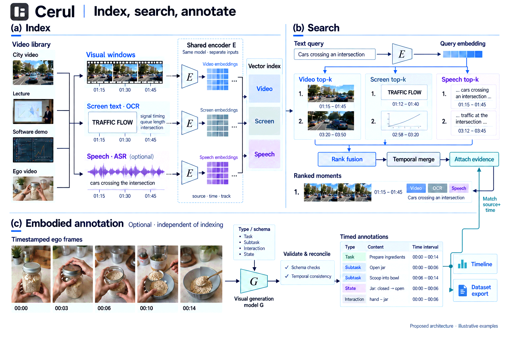

<p align="center">
  <picture>
    <source media="(prefers-color-scheme: dark)" srcset="docs/assets/cerul-logo-dark.png">
    
  </picture>
</p>

<p align="center"><strong>Help AI understand, remember, and access video.</strong></p>
<p align="center">Open-source video processing core and CLI. Use your own model endpoints, without a Cerul account.</p>

<p align="center">
  <a href="https://cerul.ai">Website</a> ·
  <a href="docs/video-search.md">Quickstart</a> ·
  <a href="docs/agent-setup.md">Install with an agent</a> ·
  <a href="docs/configuration.md">Configuration</a> ·
  <a href="https://x.com/cerul_hq">X / Twitter</a> ·
  <a href="https://discord.gg/qHDEMQB9vN">Discord</a>
</p>

<p align="center">
  <a href="https://github.com/cerul-ai/cerul/actions/workflows/ci.yml"></a>
  <a href="https://github.com/cerul-ai/cerul/releases"></a>
  
  <a href="LICENSE"></a>
  <a href="https://discord.gg/qHDEMQB9vN"></a>
</p>

<p align="center">English · <a href="README.zh-CN.md">简体中文</a> · <a href="README.zh-TW.md">繁體中文</a></p>

## Search your videos with words

Cerul turns local videos into a searchable library. Describe a moment, find text
spoken or shown on screen, and save matching clips. It works with ordinary video
folders and LeRobot datasets, using your own model API key.

- **Search by meaning or example.** Use a sentence or a reference image.
- **Find speech and screen text.** Transcription plus local, embedded OCR.
- **Keep useful results.** Export clips and structured semantic annotations.
- **Resume where you left off.** Completed work is cached; rerun after interruption.

## Getting started

Cerul is a command-line tool for searching videos and saving clips. The download
includes the media tools and OCR models it needs.

Supports **macOS Apple Silicon** and **Linux x86_64 (Ubuntu 24.04 or newer)**.

### 1. Install

```sh
curl -fsSL https://cerul.ai/install.sh | sh
```

Later, `cerul upgrade` installs the newest release over this one and leaves your
workspace, key, and annotations alone.

### 2. Add a video

```sh
cerul index ./demo.mp4
```

On first use, follow the prompt to enter your [Gemini API key](https://aistudio.google.com/apikey),
or save one ahead of time with `cerul auth set`. Cerul keeps it on your computer
for future runs. Model processing sends data to Gemini and may incur API charges.

Run `cerul` on its own at any time to see what is indexed and what to do next.

### 3. Search and save clips

```sh
cerul search "A person puts a cup on the table"
cerul search "A person puts a cup on the table" --save ./clips
```

Each result is a card with the match percentage, the time range, and a link. In
iTerm2, Ghostty, Kitty, or WezTerm it also shows a still frame of the moment; add
`--no-preview` to turn that off. With [IINA](https://iina.io) installed the link
opens the video at the matched moment instead of the beginning.

Results are numbered, so `cerul open 2` plays the second moment in your video
player without leaving the terminal.

<details>
<summary><strong>Cleaning up and shell completions</strong></summary>

```sh
cerul remove ./demo.mp4      # remove its index and sidecars; keep the video
cerul remove --cache         # free regenerable disk space
cerul completions zsh        # shell completion script
```

For zsh, save it somewhere on your `fpath`, for example
`cerul completions zsh > ~/.zfunc/_cerul`, then make sure `~/.zfunc` is in
`fpath` before `compinit` runs. For bash,
`cerul completions bash > /usr/local/etc/bash_completion.d/cerul`.

</details>

[More examples →](docs/video-search.md)

## Annotate actions and demonstrations

Label action steps, events, interactions, and state changes in a video, including
egocentric recordings and robot demonstrations. No indexing step is required.

```sh
cerul annotate ./video.mp4 --semantic subtask,event,interaction,state
```

Use `--dry-run` to preview the work. Results are saved in JSONL sidecars;
`cerul status ./video.mp4` shows their location. For LeRobot datasets, label a
first episode with `cerul annotate ./dataset --semantic --only 0`.

[Annotation types, outputs, and LeRobot examples →](docs/annotation.md)

## Let your agent do the setup

Copy this prompt into an agent that can use a terminal:

```text
Install Cerul by following https://github.com/cerul-ai/cerul/blob/main/docs/agent-setup.md. Help me set up my Gemini API key securely, search a local video, and save a matching clip. Teach me the commands in my language.
```

Agents that read skills can learn the whole command line from Cerul itself:

```sh
cerul skill --install claude    # also: codex, pi, or --dir ./skills
```

[Agent setup guide →](docs/agent-setup.md) · [Agent contract →](docs/agent.md)

## Common commands

| Goal | Command | When to reach for it |
| --- | --- | --- |
| Index a folder | `cerul index ./videos` | Walks subfolders and skips work already done |
| Preview the work | `cerul --dry-run index ./videos` | See the plan, and what will call a model, before paying for it |
| Annotate semantically | `cerul annotate ./videos --semantic` | Action labels without building a search index |
| Check progress | `cerul status` | After an interruption, or to find where sidecars live |
| Search one video | `cerul search "opening a door" --in ./demo.mp4` | Skip the rest of the library |
| Replay a result | `cerul open 2` | Open a numbered match in your video player |

Sidecar files preserve transcripts, annotations, and vectors alongside your media.
Search indexes can be rebuilt from them without model calls. LeRobot subtask
writeback is available as an explicit opt-in.

## Configure models

Cerul calls your own model endpoints, so you pick the providers and pay for your
own usage. Run `cerul config` to change any of it.

| Stage | Default | Alternatives |
| --- | --- | --- |
| Multimodal search | Gemini Embedding 2, at 3072 dimensions | Any configured endpoint |
| Speech transcription | Gemini, whenever a key is available | Groq, OpenAI, an OpenAI-compatible service, or disabled |
| Screen text (OCR) | Runs locally, no API calls | — |

Indexing builds video and text search data without generating scene descriptions,
chapters, or summaries. Use `cerul analyze ./video.mp4` for scenes and an
overview, or `cerul annotate ./video.mp4` for embodied semantic labels.
`--no-audio` skips speech independently of everything else.

[Model endpoints and credentials →](docs/configuration.md) ·
[Inspect saved output →](docs/video-search.md#inspect-video-understanding)

## How it works

Indexing encodes video, screen text, and optional speech into a shared multimodal
space. Independent visual generation produces timed annotations for actions,
interactions, and state changes, including embodied and egocentric recordings.



*Architecture with AI-generated illustrative frames. Default search combines
independent video, speech, screen-text, and description candidates with gated
full-text matches using max fusion and capped agreement. Original evidence and
timestamps remain inspectable. Dataset writeback supports opt-in LeRobot
subtasks. See [DESIGN.md](DESIGN.md) for implemented behavior.*

## Learn more

- [Documentation index](docs/README.md)
- [Installation and troubleshooting](docs/installation.md)
- [Video search tutorial](docs/video-search.md)
- [Explicit video analysis](docs/analyze.md)
- [LeRobot tutorial](docs/lerobot-subtasks.md)
- [Model endpoints and configuration](docs/configuration.md)
- [Contributing and developer integration](CONTRIBUTING.md)

## Community

Questions, bug reports, and clips you are proud of are all welcome.

[Discord](https://discord.gg/qHDEMQB9vN) ·
[Issues](https://github.com/cerul-ai/cerul/issues) ·
[X / Twitter](https://x.com/cerul_hq)

<a href="https://star-history.com/#cerul-ai/cerul&Date">
  
</a>

## License

Cerul's Rust code is Apache-2.0. Bundles also contain separately licensed media
tools and OCR weights; see [third-party notices](THIRD_PARTY_NOTICES.md).
The [Cerul name and logo](docs/assets/README.md) identify the project and do not
imply endorsement of third-party products.
