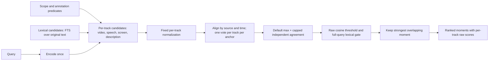

# Hybrid video retrieval proposal

Status: default hybrid retrieval is connected. See [DESIGN.md](../../DESIGN.md)
for implemented behavior. On 2026-09-13 the owner explicitly requested activation
after lightweight acceptance, replacing the earlier held-out activation gate.
Broader evaluation remains follow-up work, not a blocker for this change.

Updated: 2026-09-13. This revision records the owner's decisions, corrects
earlier statements that were stronger than the evidence, and fixes the
implementation order. A subsequent [single-video pilot](../development/retrieval-pilot.md)
verified the live pipeline and exposed ranking/localization limitations; the
representative retrieval benchmark remains pending. Prices are public list
prices, not measured bills.

## Decisions

These are settled and are not re-opened by the evaluation below.

| Decision | Value | Note |
| --- | --- | --- |
| Embedding space | Gemini Embedding 2 at **3072 dimensions**, the model's native size | The pre-change CLI locked 1536 (`main.rs`, `config.rs`). Changing it creates a new `space_id`; incompatible vectors must be rebuilt. Storage and scan cost double; embedding price does not depend on dimensions. Quality is the priority for the CLI. |
| Visual route | Native video embedding of proxy clips, by default | Do not silently switch to per-frame image embeddings. Frame embeddings remain an evaluation baseline only. |
| Retrieval window | 30-second window, 5-second overlap, as the engineering baseline | Not a demonstrated optimum. Shorter windows are evaluated with an explicit overlap policy (see cost). |
| Proxy sampling | 1 FPS, longest edge 480 px, no audio | Requires bumping the proxy recipe version so existing video checkpoints are invalidated. |
| Video understanding | Runs by default, resumable, with an explicit opt-out | Cost is bounded and small relative to embedding (see below). |
| Evidence tracks | `video`, `speech`, `screen`, and a new `description` track | One compatible space; independent rows per track; never one concatenated input. |
| Fusion | Default fixed affine max with capped agreement | Version `hybrid/affine-max-full-query-lexical/1`; raw-max rollback remains available. Constants are initial engineering choices, not fitted optima. |
| Three-surface unification | Out of scope for this proposal | Two constraints are recorded at the end so the CLI does not close doors. |

## Baseline before this implementation

Recorded here so the proposal can be read against the actual code rather than
the previous description of it.

Indexing runs three stations **sequentially** per stream: OCR, then ASR, then
embedding. OCR and ASR do not depend on each other; running them concurrently
is an available optimization, not current behavior. OCR samples a frame every
2 seconds at up to 1080 px and merges consecutive records only when the text is
byte-identical. ASR uses 60-second windows with no overlap. Embedding walks
30-second windows with a 25-second stride; each window yields one `video` row
from a 2 FPS proxy clip and, when text exists, one `speech` row and one
`screen` row whose input is every intersecting record joined with newlines,
with no deduplication and no length cap. The row-level cache key already
includes the row text and the proxy recipe, so a transcript correction reloads
unchanged video and screen rows with zero model calls.

Search embeds the query once with the `task: search result | query:` prefix,
prefilters LanceDB by time interval and kind, runs a flat cosine scan with a
budget of `max(32, 3 × limit)` that doubles when unique intervals fall short,
applies `--threshold` to raw cosine, keeps the highest-scoring row per interval
across kinds, sorts, and merges adjacent windows only when they overlap by at
least half. There is no per-kind normalization, no lexical channel beyond the
`--text` substring path, no ANN index, and no reranker.

## Window length, sampling, and cost

According to the [Gemini embedding input documentation](https://ai.google.dev/gemini-api/docs/embeddings),
checked on 2026-09-12, video input is limited to 120 seconds and 32 processed
frames. Inputs up to 32 seconds are sampled at 1 FPS; longer inputs are
uniformly sampled to 32 frames. Audio is not processed. The
[Standard price](https://ai.google.dev/gemini-api/docs/pricing#gemini-embedding-2)
is approximately USD 0.00079 per processed video frame and USD 0.00012 per image.

Consequences:

- A 30-second window is the natural unit: it is close to the 32-second 1 FPS
  budget, and a longer window only samples more sparsely.
- Sending a 2 FPS proxy wastes half the upload; the service samples 1 FPS.
- Below 32 seconds, cost depends only on total processed frames. Shorter
  windows cost the same **only if total frames stay constant**. With the
  current fixed 5-second overlap they do not:

| Window / overlap | Frames per source hour | Visual cost per hour |
| --- | --- | --- |
| 30 s / 5 s (current) | ≈ 4,320 | ≈ USD 3.41 |
| 30 s / 0 s | 3,600 | ≈ USD 2.84 |
| 15 s / 5 s | ≈ 5,400 | ≈ USD 4.27 |
| 15 s / 0 s | 3,600 | ≈ USD 2.84 |
| 10 s / 5 s | ≈ 7,200 | ≈ USD 5.69 |
| Independent images at 1 FPS | 3,600 images | ≈ USD 0.43, 3,600 vectors, no temporal representation |

Estimates exclude free quotas, retries, OCR, ASR, text embeddings,
understanding, local compute, and storage. Batch prices are half the Standard
prices but require a separate offline Batch integration. Whether the processed
frame count equals the sent duration in seconds is an assumption; the first
real request should read back the usage metadata and correct this table.

Recommendation: keep 30 s / 5 s as the baseline. Evaluate 10 and 15-second
windows with overlap held at zero or proportional, so the comparison is about
localization versus context, not about spending more. Do not build every scale
by default; generated sections provide broader context without extra video
vectors.

## Video understanding cost

Understanding uses a generation model that tokenizes video at 258 tokens per
frame at default media resolution or 66 at low resolution, 1 FPS, per the
[video understanding documentation](https://ai.google.dev/gemini-api/docs/video-understanding).
Proxy clips carry no audio, so audio tokens do not apply. Output is structured
scene records, estimated at 20,000 to 40,000 tokens per source hour.

| Model, Standard price per 1M tokens (input / output) | Default resolution, per hour | Low resolution, per hour |
| --- | --- | --- |
| Gemini 3.8 Flash, 0.75 / 3.75 (through 2026-12-31; doubles in 2027) | ≈ USD 0.81 | ≈ USD 0.29 |
| Gemini 3.5 Flash-Lite, 0.30 / 2.50 | ≈ USD 0.35 | ≈ USD 0.15 |
| Gemini 3.5 Flash, 1.50 / 9.00 | ≈ USD 1.66 | ≈ USD 0.63 |

Understanding is therefore cheaper than the visual embedding it accompanies.
Media resolution and sampling rate are explicit parameters of the
understanding recipe and are recorded in generation metadata and in the
invalidation fingerprint. Splitting long videos into windows adds only prompt
overhead per request. Prompts and schemas must be measured on the first real
run before these numbers are quoted anywhere else.

## Representations

| Evidence | Embedding input | Other representation | Role |
| --- | --- | --- | --- |
| Video | Proxy clip of one retrieval window | Source, stream, time, sample recipe | Appearance, spatial relations, visible motion |
| Screen text | Retrieval text derived from OCR records within the window | Original records with exact spans, untouched | Names, code, slide labels; literal and semantic search |
| Speech | Transcript text within the window | Original utterances, language, timestamps | What was said; literal and semantic search |
| Description (proposed) | One concise visible scene/action description **per scene record, over the scene's own interval** | Structured scene record and sampled-frame evidence | Natural-language descriptions of observed activity |
| Structured fields (proposed extension) | Optional deterministic sentence from one coherent record | Typed fields, ontology, confidence, source refs | Predicate filtering and explainable matching |
| Video summary (proposed) | Optional coarse video-level representation, separate retrieval level | Title, overview, coverage, dependencies | Library browsing; never precise moment evidence |

Rules that survive from the earlier revision: generate once and keep structured
records; do not embed every JSON field; keep visual descriptions free of
transcript paraphrases and copied OCR; one field carries one modality.

Text rows use the documented document format `title: none | text: {content}`.
Multimodal inputs are not prefixed, per the provider's guidance. Whether the
query prefix helps or hurts text-to-video matching is unknown and is an
evaluation variable, not a decision.

## Indexing and updates

1. Preserve the source/episode/stream time mapping and authoritative sidecars.
2. **Decode once, sample per purpose.** Share one timestamped decode pass and
   frame cache; produce the OCR frames, the 1 FPS proxy, and the understanding
   input as different resolutions and subsets of it. OCR keeps source
   resolution up to 1080 px; the proxy stays at 480 px; understanding may add
   scene-change frames. Sharing timestamps is the point, not sharing pixels.
3. OCR samples at 1 FPS with a change gate: skip recognition when the frame is
   nearly identical to the last recognized frame, **but keep a periodic floor**
   so a small change such as a single digit is not missed indefinitely. The
   gate reduces work on static content; it does not guarantee fewer
   recognitions on every video, and 1 FPS is a sampling interval, not a
   measured text-appearance boundary.
4. OCR and ASR write original records unchanged. **Deduplication and length
   limits apply to the derived retrieval text, never to the sidecar.** Build
   the screen-text retrieval input by removing near-duplicate lines; when it
   exceeds the model limit, split it into additional rows over sub-intervals
   rather than truncating. Do not normalize case or punctuation in code,
   identifiers, or error strings.
5. Run OCR and ASR concurrently where the runtime allows; embedding still waits
   for both.
6. Run visual understanding by default over timestamped windows or contact
   sheets from the shared frame cache. Record actual sample coverage; sparse
   frames do not establish continuous coverage or exact motion boundaries.
7. Validate generated fields and temporal ranges before publication. Record
   model, prompt/schema version, media resolution, sampling rate, input hashes,
   and source references.
8. Embed each track with its own dependency fingerprint. Correcting speech
   must not rerun visual generation or re-embed unchanged video. The current
   row-level cache already provides this for existing tracks; the description
   track must follow the same pattern.
9. Description vectors enter default retrieval independently from the base tracks.
   Full-query OCR/ASR matches also participate. Preserve original evidence and
   score units; do not concatenate modalities or claim fitted calibration.
10. Rebuild the vector and record indexes from sidecars without model calls.

Stable logical annotation IDs identify source/stream/window/type. A separate
generation ID identifies model/prompt/input revisions. Re-segmentation needs an
explicit mapping, not index-based renumbering. Manual corrections live in a
separate revision layer that generation cannot overwrite.

## Retrieval

**For future fitted calibration, step zero is measurement.** Before fitting parameters: index a small set,
run twenty to thirty queries, and export the score distribution of each kind
for relevant and irrelevant hits. The hypothesis is a modality bias, where
text-to-text similarity runs higher than text-to-video for equally relevant
evidence, which is well documented for contrastive multimodal encoders. Its
direction and size for this model are **unmeasured**. The measurement decides
whether calibration is a constant offset, an affine map, or unnecessary, and
it is a prerequisite for fitting the calibrated-max candidate below. The pure,
parameterized fusion implementations and offline replay can be built before
that measurement. This implementation-order adjustment keeps engineering work
independent of paid corpus preparation; it does not supply calibration constants
or establish optimal constants. The owner subsequently authorized an initial
fixed recipe after lightweight acceptance; held-out comparisons remain future
quality evaluation.

Candidates for future comparison on the same held-out set:

| Candidate | What it must show |
| --- | --- |
| Current raw max across kinds | Baseline |
| Per-track calibration, then max, plus a capped bonus when independent tracks agree | Keeps strong single-track hits; uses multi-track evidence without letting an irrelevant track drag a good hit down |
| Grouped weighted RRF with a pre-fusion relevance gate | Robust to score scale; rank-only, so it needs the gate to say "nothing relevant" |
| Joint concatenation | Ablation only |

Rules that apply to every candidate:

- Query encoding stays one call per compatible `space_id`, cached on disk.
- Each present track returns its own bounded candidate list, so text
  candidates cannot crowd out video candidates.
- Video and description rows are correlated; they form one visual group
  contributing at most one vote per anchor. Screen and speech form a textual
  group with duplicate same-time text capped to the strongest contribution.
- A track absent from a candidate contributes zero; enabled-track weights are
  fixed per query, not renormalized per candidate. Do not reward a candidate
  for lacking audio.
- **Description-to-anchor mapping is explicit.** A description over its own
  interval may attach to at most one anchor: the greatest temporal IoU,
  provided overlap covers at least half of both intervals and the description
  is no longer than the anchor. Otherwise it stays a candidate over its own
  interval. Ties use source time and stable identity. A 90-second description
  cannot vote for every overlapping 30-second window. Its original interval
  is always retained, and its actions are never assigned finer timestamps by
  overlap alone.
- Calibrated scores are relevance scores, not probabilities, and the numeric
  meaning of `--threshold` must be re-validated after calibration. RRF needs
  an explicit relevance gate for the same reason.
- Fused scores keep raw per-track scores and ranks for diagnosis.
- Compound queries about order or simultaneity need explicit temporal
  verification, not a higher fusion score. Adjacency alone never merges a
  whole video.

Lexical retrieval: add a full-text index over original transcript and screen
text as one more candidate source, built from sidecars as a rebuildable cache.
LanceDB's Rust SDK provides FTS and RRF hybrid reranking. `--text` stays exact
substring matching without embedding calls and is not replaced by BM25.

No LLM query planner and no mandatory VLM reranker in this proposal. Evidence
from adjacent work: query-level routing lost to chunk-level selection in
[CARVE](https://arxiv.org/html/2606.13141); an MLLM reranker over top-5
candidates moved Ego4D NLQ R@1 from 21.63 to 21.78 in the
[2026 challenge winner](https://arxiv.org/html/2605.20818). Neither transfers
directly to Cerul, but neither justifies the latency and cost now.

Related systems and what they do and do not establish:
[MMMORRF](https://arxiv.org/html/2503.20698v4) shows text tracks carry most of
the retrieval quality on MultiVENT 2.0 and weighted RRF adds a few points;
[CLaMR](https://arxiv.org/pdf/2506.06144) shows averaging similarities across
modalities is hurt by irrelevant modalities, using a trained late-interaction
model, which does not prove any particular untrained fusion rule is best;
[CARVE](https://arxiv.org/html/2606.13141) finds clip-level visual embeddings
beat frame-level and text-only, and that no single configuration wins;
[Unified Interactive Multimodal Moment Retrieval](https://arxiv.org/html/2512.12935v1)
uses min-max normalized weighted fusion and temporal decay without ablations.

## Authoritative storage and consumers

Unchanged from the earlier revision: extend the per-episode sidecar with
`semantic.scene.jsonl`, `semantic.section.jsonl`, and `semantic.summary.jsonl`
under the existing `semantic` family and the `annotation/1` envelope; schemas
originate in Rust types; Parquet holds vectors per space; LanceDB tables are
caches rebuilt with zero model calls; write validated content atomically before
publishing index updates; source changes invalidate descendants per track.

Additions in this revision:

- The Parquet and Lance `kind` column gains `description`. Text rows record
  which retrieval-text derivation produced them, so a change in dedup or
  splitting rules invalidates only text rows.
- The full-text index is a separate workspace cache keyed by source record
  revisions and tokenizer recipe, **independent of embedding `space_id`**.
  Changing embedding dimensions or endpoints does not rebuild lexical data.
- Understanding metadata records media resolution and sampling rate.

## Segmentation and missing evidence

Unchanged: retrieval windows, visual shots, and semantic steps stay distinct;
generated sections are navigation, never a hard prefilter. The behavior table
from the earlier revision still applies: absent ASR searches remaining tracks;
failed understanding leaves the episode searchable with an incomplete status;
explicit opt-out records a deliberate skip; a changed space rejects
incompatible vectors; cached results with missing credentials rebuild without
remote work.

## Performance claims

The pipeline diagram is not a latency measurement. Query encoding incurs a
provider round trip on a cache miss; per-track retrieval, FTS, filtering,
alignment, and fusion all add work. The current SDK plan must be inspected and
benchmarked before claiming a single scan serves every track. Record cold and
warm P50/P95, dimensions, row count, hardware, and candidate budgets. Published
estimates from another application are not acceptance evidence for this CLI.

## Evaluation

Build an owner-reviewed set covering ordinary clips, lectures and screen
recordings, silent video, and first-person demonstrations. Include
visible-only, spoken-only, literal-identifier, state-change, "mentioned versus
demonstrated", and **no-answer** queries. Label source interval and evidence
modality. Split tuning videos from acceptance videos. A single video with
twenty queries is a diagnostic for step zero, not a basis for final
parameters.

Measure Recall@K, nDCG, temporal localization, duplicate-hit rate, incorrect
evidence attribution, false positives on no-answer queries, P50/P95 latency,
model calls, and cost. Remove modalities explicitly; test ASR corrections,
stale sidecars, and interrupted rebuilds.

## Implementation order

The implementation now includes 3072 defaults, shared samples, text hygiene,
concurrent OCR/ASR, independent candidate budgets, lexical projection, default
understanding, separate description vectors, and an offline
[diagnostic exporter and evaluator](../development/retrieval-evaluation.md).
One authorized live pilot and zero-call candidate replays have been completed;
representative model benchmarks and owner-reviewed held-out labels are pending.
Parameterized calibrated-max and grouped-RRF recipes now run through a shared
Rust module and an offline replay tool, retaining original evidence and checking
recipe/source provenance. The first candidate uses two conservative groups:
video/description and speech/screen/lexical, each capped at its strongest vote.
This also caps distinct speech and screen matches; whether that loses useful
agreement is an evaluation question, not an established optimum. Default search
now uses the fixed affine-max recipe, gated full-text candidates, and description
projection. Lightweight cached-pilot replay and behavioral checks cover activation;
this is not a representative quality benchmark. Calibration fitting and ANN
activation remain future work. A zero-model-call, synthetic 100k-row
[engine benchmark](../development/retrieval-evaluation.md#engine-only-benchmark)
records flat/IVF_FLAT latency and exact-neighbor recall; it does not satisfy the
representative-data gate for ANN activation.

1. Switch the default space to 3072 dimensions and unlock the fixed value.
2. Step-zero measurement of per-kind score distributions.
3. Cheap index hygiene: shared decode and 1 FPS proxy with a recipe bump;
   screen-text retrieval text derivation with dedup and splitting; document
   prefix on text rows; OCR/ASR concurrency.
4. Evaluation harness and labeled set.
5. Per-track candidate retrieval and the full-text candidate source.
6. Default visual understanding with independent invalidation; description
   rows stored and retrieved by default.
7. Implement parameterized fusion and replay independently of corpus collection.
   Fit calibration and gates on tuning data after diagnostic measurement; then
   compare frozen candidates on held-out data. This can replace the initial
   default recipe if measurements support an improvement.
8. Measure flat-search and ANN behavior near one hundred thousand rows. Enable
   ANN only when measured latency warrants it and recall remains acceptable.
   Row count is a benchmark checkpoint, not a universal performance limit.

## Out of scope, recorded for later

Unifying the desktop and cloud implementations on this core is a separate
plan. Two of its constraints shape choices made here and must not be closed
off: the desktop's policy that a remote provider never receives frames or
video without explicit authorization, which means the visual route must be
configurable per surface; and the possibility of a second vector projection
backend, which means search logic must not assume LanceDB-specific behavior
beyond the documented prefilter and cosine contract. Conformance across
surfaces should require identical evidence types, intervals, and filter
semantics, with a stated tolerance for approximate recall.
